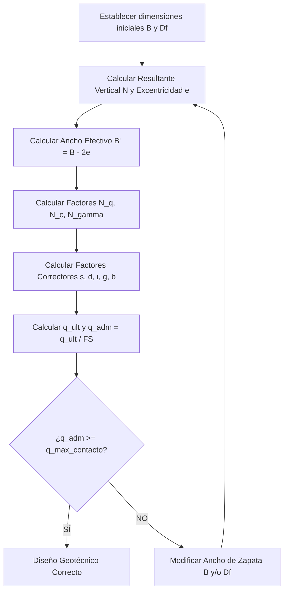

# 01. Guía de Cálculo: Capacidad de Soporte del Suelo de Fundación

Esta guía establece el procedimiento de cálculo analítico para determinar la capacidad de soporte (o capacidad portante) última y admisible de un suelo de fundación bajo zapatas corridas, de acuerdo con la práctica de ingeniería en Chile y bajo el alero de la norma **NCh1508** (Estudios de Mecánica de Suelos).

---

## 1. Identificación y Caracterización del Suelo (NCh1508)

El primer paso es clasificar el suelo según el sistema USCS (Sistema Unificado de Clasificación de Suelos) y obtener sus parámetros resistentes de diseño mediante ensayos in situ (SPT, CPT) y de laboratorio (triaxial, corte directo).

### 1.1 Condición de Drenaje y Resistencia al Corte
La capacidad de soporte debe evaluarse para dos condiciones críticas de comportamiento del suelo:

*   **Condición No Drenada (Corto Plazo / Arcillas y Limos saturados):**
    *   Suelos finos de baja permeabilidad en los que las presiones de poros no se disipan instantáneamente durante la aplicación de la carga.
    *   Se asume un ángulo de fricción aparente nulo ($\phi_u = 0^\circ$).
    *   La resistencia al corte está regida únicamente por la **cohesión no drenada** ($s_u$ o $c_u$).
*   **Condición Drenada (Largo Plazo / Arenas, Gravas y Arcillas Consolidadas):**
    *   Suelos granulares de alta permeabilidad o suelos finos donde las cargas se aplican con suficiente lentitud para permitir el drenaje libre de la presión de poros.
    *   Se utilizan los parámetros de resistencia efectivos: el **ángulo de fricción efectiva** ($\phi' > 0^\circ$) y la **cohesión efectiva** ($c'$).

---

## 2. Ecuación General de Capacidad de Soporte

La formulación general que rige la falla por corte generalizado del suelo bajo una cimentación superficial continua (zapata corrida) se basa en la extensión de la teoría de Terzaghi propuesta por **Hansen (1970)** y **Vesić (1973/1975)**:

$$q_{ult} = c \cdot N_c \cdot s_c \cdot d_c \cdot i_c \cdot g_c \cdot b_c + q \cdot N_q \cdot s_q \cdot d_q \cdot i_q \cdot g_q \cdot b_q + \frac{1}{2} \cdot \gamma \cdot B' \cdot N_\gamma \cdot s_\gamma \cdot d_\gamma \cdot i_\gamma \cdot g_\gamma \cdot b_\gamma$$

Donde:
*   $q_{ult}$: Capacidad de soporte última del suelo (kPa o $\text{kN/m}^2$).
*   $c$: Cohesión del suelo (cohesión efectiva $c'$ o cohesión no drenada $c_u$ según corresponda).
*   $q$: Presión de sobrecarga efectiva al nivel del sello de fundación ($q = \gamma \cdot D_f$).
*   $D_f$: Profundidad de desplante o sello de fundación (m).
*   $\gamma$: Peso unitario del suelo (efectivo, húmedo o sumergido según la posición de la napa).
*   $B'$: Ancho efectivo de la zapata (m), corregido por excentricidad de la carga ($B' = B - 2e$).
*   $N_c, N_q, N_\gamma$: Factores adimensionales de capacidad de soporte.
*   $s_c, s_q, s_\gamma$: Factores correctores por forma de la zapata.
*   $d_c, d_q, d_\gamma$: Factores correctores por profundidad de desplante.
*   $i_c, i_q, i_\gamma$: Factores correctores por inclinación de la carga.
*   $g_c, g_q, g_\gamma$: Factores correctores por inclinación del terreno (topografía/proximidad a talud).
*   $b_c, b_q, b_\gamma$: Factores correctores por inclinación de la base de la zapata.

---

## 3. Determinación de los Factores Geotécnicos

### 3.1 Factores de Capacidad de Soporte ($N_c, N_q, N_\gamma$)
Dependen exclusivamente del ángulo de fricción interna del suelo ($\phi$). Se calculan analíticamente:

1.  **Factor por Sobrecarga ($N_q$):**
    $$N_q = e^{\pi \tan \phi} \tan^2\left(45^\circ + \frac{\phi}{2}\right) = e^{\pi \tan \phi} \left( \frac{1 + \sin \phi}{1 - \sin \phi} \right)$$
2.  **Factor por Cohesión ($N_c$):**
    $$N_c = \frac{N_q - 1}{\tan \phi} \quad (\text{para } \phi > 0^\circ)$$
    Si $\phi = 0^\circ$ (condición no drenada), se tiene: $N_c = 5.14$.
3.  **Factor por Peso Propio del Suelo ($N_\gamma$):**
    El valor de este factor varía según la teoría geotécnica adoptada:
    *   **Hansen (1970):**
        $$N_\gamma = 1.5(N_q - 1)\tan \phi$$
    *   **Vesić (1973/1975):**
        $$N_\gamma = 2(N_q + 1)\tan \phi$$
        *Nota: La formulación de Vesić es la recomendada en la mayoría de los informes de mecánica de suelos chilenos por ser consistente con ensayos a escala real.*
    *   Si $\phi = 0^\circ$ (condición no drenada): $N_\gamma = 0$.

---

### 3.2 Factores de Forma ($s_c, s_q, s_\gamma$)
Para muros de contención con zapatas longitudinales corridas (donde el largo $L$ es infinitamente mayor que el ancho $B$, es decir, $B/L \to 0$):
*   $$s_c = 1.0$$
*   $$s_q = 1.0$$
*   $$s_\gamma = 1.0$$

---

### 3.3 Factores de Profundidad ($d_c, d_q, d_\gamma$)
Toman en cuenta la resistencia al corte del suelo ubicado por encima del plano de sello de fundación ($D_f$). Dependen de la relación $D_f/B'$:

#### Caso A: $D_f / B' \le 1.0$
*   **Para el término de cohesión ($d_c$):**
    *   Si $\phi > 0^\circ$:
        $$d_c = 1 + 0.4 \left( \frac{D_f}{B'} \right)$$
    *   Si $\phi = 0^\circ$ (condición no drenada):
        $$d_c = 1 + 0.4 \left( \frac{D_f}{B'} \right)$$
*   **Para el término de sobrecarga ($d_q$):**
    $$d_q = 1 + 2 \tan\phi (1 - \sin\phi)^2 \left( \frac{D_f}{B'} \right)$$
*   **Para el término de gravedad ($d_\gamma$):**
    $$d_\gamma = 1.0 \quad (\text{para cualquier valor de } \phi)$$

#### Caso B: $D_f / B' > 1.0$
*   **Para el término de cohesión ($d_c$):**
    *   Si $\phi > 0^\circ$:
        $$d_c = 1 + 0.4 \arctan\left( \frac{D_f}{B'} \right) \quad (\text{en radianes})$$
*   **Para el término de sobrecarga ($d_q$):**
    $$d_q = 1 + 2 \tan\phi (1 - \sin\phi)^2 \arctan\left( \frac{D_f}{B'} \right) \quad (\text{en radianes})$$
*   **Para el término de gravedad ($d_\gamma$):**
    $$d_\gamma = 1.0$$

---

### 3.4 Factores de Inclinación de la Carga ($i_c, i_q, i_\gamma$)
Se aplican cuando la carga resultante que actúa sobre el sello tiene una componente horizontal ($H_{resultante}$) debido a empujes laterales del suelo o sismo, inclinando la línea de rotura en el terreno:

*   **Para el término de sobrecarga ($i_q$):**
    $$i_q = \left( 1 - \frac{H_{resultante}}{V_{resultante} + B' \cdot c \cdot \cot\phi} \right)^m$$
*   **Para el término de gravedad ($i_\gamma$):**
    $$i_\gamma = \left( 1 - \frac{H_{resultante}}{V_{resultante} + B' \cdot c \cdot \cot\phi} \right)^{m+1}$$
*   **Para el término de cohesión ($i_c$):**
    *   Si $\phi > 0^\circ$:
        $$i_c = i_q - \frac{1 - i_q}{N_c \tan \phi}$$
    *   Si $\phi = 0^\circ$ (condición no drenada):
        $$i_c = 1 - \frac{m \cdot H_{resultante}}{B' \cdot c_u \cdot N_c}$$

*Donde el exponente $m$ para cargas en dirección longitudinal/paralela al ancho de la zapata es:*
$$m = \frac{2 + B'/L}{1 + B'/L}$$
Para zapata corrida ($B'/L \to 0$): $m = 2.0$.

---

### 3.5 Factores por Terreno Inclinado y Proximidad a Taludes ($g_c, g_q, g_\gamma$)
Cuando un muro de contención se encuentra asentado sobre un talud o cerca de la cresta del mismo, disminuye el confinamiento lateral en la zona de empuje pasivo de la cuña de falla.

Hansen define los factores correctores por terreno inclinado (donde el terreno tiene una inclinación $\beta$ en grados respecto al plano horizontal):

*   **Término de sobrecarga y peso propio ($g_q$ y $g_\gamma$):**
    $$g_q = g_\gamma = (1 - \tan \beta)^2 \quad (\text{Hansen})$$
    Alternativamente, para ángulos menores se puede aplicar la aproximación del Manual de Carreteras:
    $$g_q = g_\gamma = (1 - 0.5 \tan \beta)^5$$
*   **Término de cohesión ($g_c$):**
    *   Si $\phi > 0^\circ$:
        $$g_c = \frac{N_q \cdot g_q - 1}{N_q - 1}$$
    *   Si $\phi = 0^\circ$ (condición no drenada):
        $$g_c = 1 - \frac{2\beta}{\pi + 2} \quad (\beta \text{ en radianes})$$

---

### 3.6 Factores de Base Inclinada ($b_c, b_q, b_\gamma$)
Si el sello de excavación o la base de la zapata del muro tiene una inclinación $\eta$ respecto a la horizontal (por ejemplo, para generar mayor resistencia al deslizamiento excavando "en diente" o cuña):

*   **Término de sobrecarga y peso propio ($b_q$ y $b_\gamma$):**
    $$b_q = b_\gamma = (1 - \eta \cdot \tan \phi)^2 \quad (\eta \text{ en radianes})$$
*   **Término de cohesión ($b_c$):**
    *   Si $\phi > 0^\circ$:
        $$b_c = b_q - \frac{1 - b_q}{N_c \tan \phi}$$
    *   Si $\phi = 0^\circ$ (condición no drenada):
        $$b_c = 1 - \frac{2\eta}{\pi + 2} \quad (\eta \text{ en radianes})$$

---

## 4. Efecto del Nivel Freático (NF)

La presencia de agua reduce el esfuerzo efectivo en el suelo debido a las presiones de poros. Geotécnicamente, se deben modificar los pesos específicos ($\gamma$) y las sobrecargas ($q$) de acuerdo con la profundidad del nivel freático ($d_w$ medida desde la superficie del terreno):

```
       ▼ Superficie
       │
       │   Suelo Húmedo (γ = γ_nat)
       │
───────┼────── Sello de Fundación (y = Df)
       │ 
       │   Zona de falla (espesor ≈ B)
       │
───────┴────── Profundidad crítica (y = Df + B)
```

### Escenario A: Agua sobre el nivel de fundación ($d_w \le D_f$)
1.  **Sobrecarga efectiva ($q$):**
    $$q = \gamma_{nat} \cdot d_w + (\gamma_{sat} - \gamma_w) \cdot (D_f - d_w)$$
2.  **Término de gravedad ($\gamma$ del tercer sumando):**
    Se utiliza el peso sumergido o boyante:
    $$\gamma' = \gamma_{sat} - \gamma_w$$
    *(donde $\gamma_w = 9.81 \text{ kN/m}^3$)*

### Escenario B: Agua en la cuña de falla bajo la fundación ($D_f < d_w < D_f + B$)
1.  **Sobrecarga efectiva ($q$):**
    $$q = \gamma_{nat} \cdot D_f$$
2.  **Término de gravedad ($\gamma$ del tercer sumando):**
    Se pondera el peso volumétrico según la posición del NF en la zona de rotura (espesor aproximado al ancho de la zapata $B'$):
    $$\gamma_{prom} = \gamma' + \frac{d_w - D_f}{B'} (\gamma_{nat} - \gamma')$$

### Escenario C: Agua profunda ($d_w \ge D_f + B$)
El agua está lo suficientemente profunda como para no interactuar con el mecanismo de falla por corte.
1.  **Sobrecarga efectiva ($q$):**
    $$q = \gamma_{nat} \cdot D_f$$
2.  **Término de gravedad ($\gamma$):**
    $$\gamma = \gamma_{nat}$$

---

## 5. Capacidad de Soporte Admisible ($q_{adm}$)

Para garantizar la estabilidad y evitar deformaciones excesivas (asentamientos diferenciales y totales), se define la capacidad admisible del suelo dividiendo el valor último obtenido por un Factor de Seguridad ($FS$):

$$q_{adm} = \frac{q_{ult}}{FS}$$

### 5.1 Factores de Seguridad (FS) según Condiciones de Carga
Bajo la práctica estructural y geotécnica estándar en Chile, se diferencian dos situaciones críticas de carga:

*   **Caso Estático (Combinaciones de Carga Normales):**
    Se asume un factor de seguridad estricto para prever variaciones del suelo y consolidación a largo plazo:
    $$FS = 3.0$$
*   **Caso Sísmico o Eventual (Combinaciones de Carga Sísmicas):**
    Debido a la naturaleza transitoria y de corta duración de la carga sísmica, la normativa permite reducir el factor de seguridad para evitar cimentaciones sobredimensionadas:
    $$FS = 2.0$$

---

## 6. Procedimiento Práctico Iterativo de Cálculo

Dado que las zapatas de muros de contención se encuentran sujetas a excentricidades importantes debido a los empujes horizontales de tierras, el ancho efectivo de la zapata ($B'$) cambia con las dimensiones iniciales planteadas. El flujo ordenado para el cálculo geotécnico es:



*Nota: La presión de contacto máxima en la punta se determina a partir del cálculo de estabilidad externa detallado en el documento `02_estabilidad_muro_contencion.md`.*
